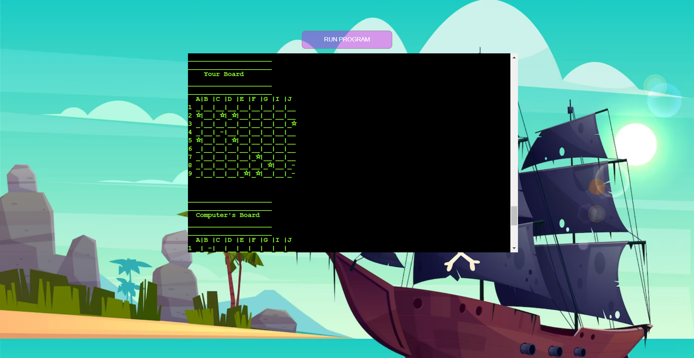

# BATTLESHIP GAME PROJECT 3

# Introduction
[View the live project here](https://battleship-game.herokuapp.com/)
This Battleships game is Portfolio Project 3 - Python Essentials created for Diploma in Full Stack Software Development at [Code Institute](https://codeinstitute.net/se/) . This project is about building a command-line application that allows users to manage a common dataset about a particular domain.

Battleship game is a Python Terminal Game, which runs in Heroku. 

The Battleships game is played on grids on which each player's fleet of battleships are marked. The locations of the fleets are concealed from the other player. Players call shots at the other player's ships, and the objective of the game is to destroy the opposing player's fleet.
The application provides a working battleships game for a single user to play against the computer. 
# How to play 

After pressing on run the game, entering the user's name, the user can see the game instructions and a table showing the size of the ships. The user then places ships on his board by selecting letters in a column and numbers in a row. After placing their ships, the user guesses where the ships are on the computer board. The game ends when the computer or the user guesses where all the ships are.

# Features
## Existing Features
In this game a player have access to two game boards. First, the player have to place the ships on a game board. And afterwords shuold guess where the ships are placed on the opponent's game board. 

There are 5 ships named: Carrier, Battleship, Cruiser, Submarine, Destroyer. All of the them are on the same size.

Guessed ships are marked with an 'X'.The game ends when all the ships have been guessed.
## Future Features
# Data Model
# Testing
## Bugs
### Solved Bugs
### Remaining Bugs
## Validator Testing 

# Deployment
# Credits
- background-image [Pexel](https://www.pexels.com/sv-se/foto/'hav-himmel-vatten-moln-445363/)

- I was inspired by this video to create the table of the ships: https://www.youtube.com/watch?v=OkB7JqlkTBU&t=1057s

- I used template for Python [Project 3 Teplate](https://github.com/Code-Institute-Org/python-essentials-template)

- I used this website to write my first code in Python https://www.programiz.com/python-programming/online-compiler/

