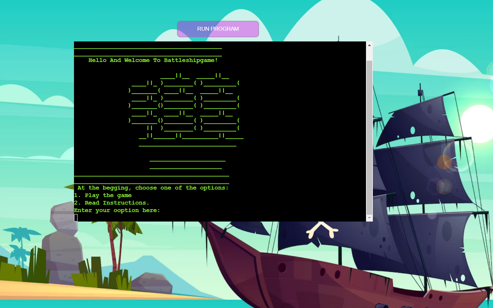
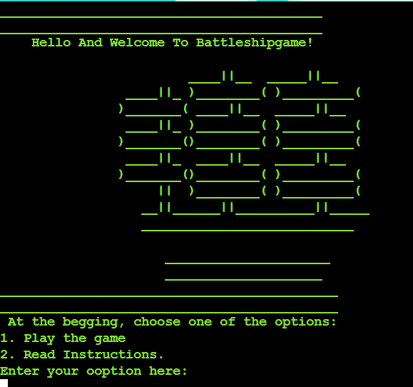
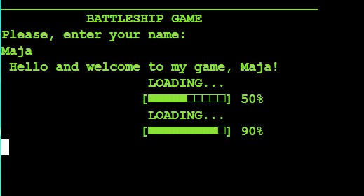
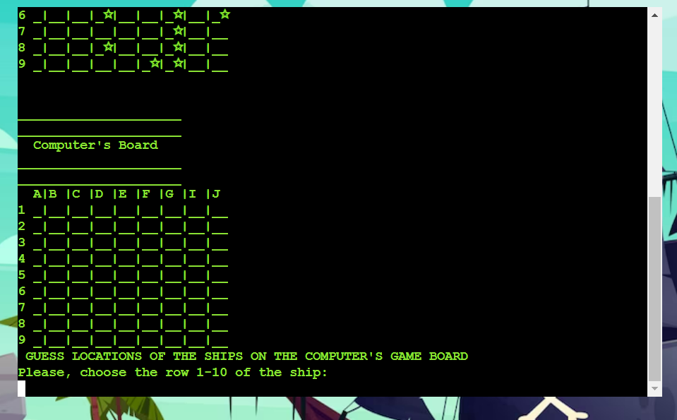
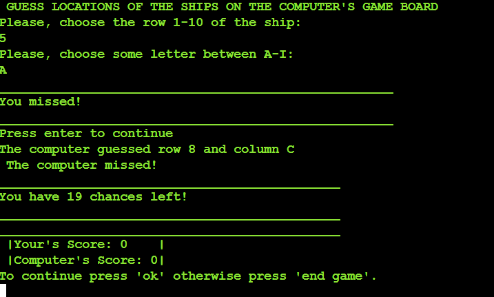

# BATTLESHIP GAME PROJECT 3

# Introduction
[View the live project here](https://battleship-game.herokuapp.com/)
This Battleships game is Portfolio Project 3 - Python Essentials created for Diploma in Full Stack Software Development at [Code Institute](https://codeinstitute.net/se/) . This project is about building a command-line application that allows users to manage a common dataset about a particular domain.

Battleship game is a Python Terminal Game, which runs in Heroku. 

The Battleships game is played on grids on which each player's fleet of battleships are marked. The locations of the fleets are concealed from the other player. Players call shots at the other player's ships, and the objective of the game is to destroy the opposing player's fleet.
The application provides a working battleships game for a single user to play against the computer. 

# User Experience (UX)
## User Stories:
- as a user I want to be welcomed by a start screen with name of the game.
- as a user i want the computer to create boards with ships hidden for me.

- as a user I want the board to be visible to me so I can see which ships are hits and which are misses. 

- as a user, I want to see the game board so I can see my hits and misses.

- as a user, I want to see both boards so I can see everything I need to play.

- as a user, I want to see whose turn it is so I know when it's my turn.

- as a user, I want to know who won.

# How to play 

After pressing on run the game, entering the user's name, the user can see the game instructions and a table showing the size of the ships. The user then places ships on his board by selecting letters in a column and numbers in a row. After placing their ships, the user guesses where the ships are on the computer board. The game ends when the computer or the user guesses where all the ships are.

# Features
## Existing Features

- Introductory text and drawing after starting the game:

- Start text where the user is asked to enter user's name.

- Further text where the user has to press enter to continue the game.

- Introduction, game instructions and ships size table.

- The user has to enter the column number and the letter of row to place user's ships on the board.

- The user has is to guess where the ships are located on the computer board.

- Error-checking:

- Game Over Message

In this game a player have access to two game boards. First, the player have to place the ships on a game board. And afterwords shuold guess where the ships are placed on the opponent's game board. 

There are 5 ships named: Carrier, Battleship, Cruiser, Submarine, Destroyer. All of the them are on the same size.

Guessed ships are marked with an 'X'.The game ends when all the ships have been guessed.
## Future Features
- add size for ships

# Designe
- Flow Charts

The diagram below shows the structure of the functions presented in the run.py file:

# Data Model
The model class Board has been used. 
The class Board includes:
    - board, 
    - number of ships, 
    - guessing enemy ships
# Testing

Testing information can be found in separate [testing.md](TESTING.md) file

# Deployment

- This program was deployed to Heroku. The steps to deploy are as follows:
    - Login to Heroku
    - In the Heroku, select: Create new app
    - Enter name of the app
    - Enter region of the app
    - Navigate to the Settings tab.
    - In 'Config Vars' select 'PORT' as a key to and '8000' as a value
    - In 'Buildpacks' select 'Add buildpack' and choose python and nodejs.
    - From the tab on the top, select: Deploy.
    - Afrerword select Github and connect.
    - Enter the respository name on Github and select: Search
    - Click connect button.
    - In Manual deploy, select the 'Deploy Branch' option
    - Select 'Open app' on the right hand side of the screen
    - The app should appear in a new tab on the web browser
    - The live link can be found here - https://battleship-game.herokuapp.com/
# Credits
- background-image [Pexel- ships at the sea](https://images.pexels.com/photos/445363/pexels-photo-445363.jpeg?auto=compress&cs=tinysrgb&w=1260&h=750&dpr=1)

- [Python Value Error](https://www.digitalocean.com/community/tutorials/python-valueerror-exception-handling-examples) - this page was used to write python code to value error.

- [Project 3 Teplate](https://github.com/Code-Institute-Org/python-essentials-template)- this template for Python was used.
- [PEP8](https://pep8ci.herokuapp.com/#) - this page was used for checking my code for PEP8 requirements

