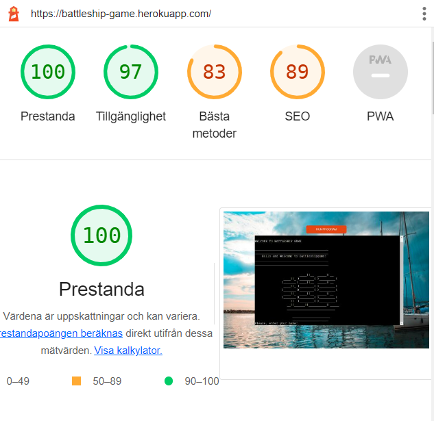
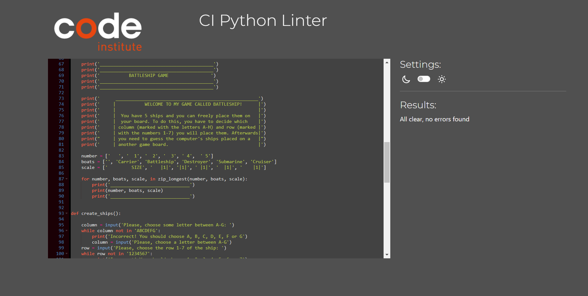

# Battleship Game - Testing details

[Main README.md file](README.md)

[View the live project here](https://battleship-game.herokuapp.com/)

# Automated Testing

## Testing Lighthouse 

## Testing Validator PEP8

No error founds on PEP8online.com

# Manual Testing

### Testing User Experience (UX) stories:

- as a user I want to be welcomed by a start screen with name of the game.
    - Start screen with name of the game is possible immediately after pressing button 'RUN PROGRAM'.
- as a user I want to be able to write my name in the begining of game.
    - Entering a name is possible after the introductory text.
- as a user i want the computer to create boards with ships hidden for me.
    - Computer ships are not visible on the board from the beginning of the game.
- as a user I want the board to be visible to me so I can see which ships are hits and which are misses. 
    - On the board, hited ships are marked with:'x' and missed with: '.'
- as a user, I want to see both boards so I can see everything I need to play.
    - The player board and the computer board are visible to the user.
- as a user, I want to see whose turn it is so I know when it's my turn.
    - The user's turn is when the information is displayed there the user has to select a column and a row of a ship on the board.
- as a user, I want to know who won.
    - The final information at the end of the game shows the final result.

### Test Cases and Results

1. Start Game:
- After pressing 'RUN PROGRAM':
    - The introductory text is shown.
    - The drawing of a ship is shown.
    - An option is displayed to choose to see instructions or start the game:
        - 1. By pressing 1 the Battleship game start.
            - The text 'Please, enter your name:' is shown.
                - After pressing a name, the following message is displayed: 'Hello ... and welcome in my game!'
        - 2. By pressing 2 the rules of the game are shown.
            - The text : 'press enter to start a game' is shown.
                - The text 'Please, enter your name:' is shown.
                    - After pressing a name, the following message is displayed: 'Hello ... and welcome in my game!'
                        - Loading of the game is displayed
                        - The game board is shown.
        - 3. By pressing someting else, following message: 'Inorrect!!! You entered: {option}. Please enter 1 or 2.' is displayed. 
2. Play game:
- The following information is displayed: 'GUESS LOCATIONS OF THE SHIPS ON THE COMPUTER'S GAME BOARD'.
- The computer board is shown, the user is supposed to guess where the computer ships are located.
     - The following message is displayed:'Please, choose the row 1-9 of the ship:
        - when the user select a number except 1-9, the following message is displayed: '{the number} is wrong! Incorrect! You should choose 1, 2, 3, 4, 5, 6 ,7, 8 or 9'.
         - when the user select a number between 1-9, the board game is shown with a ship is marked of the user.
     - The following message is displayed:'Please, choose a letter between A-I.'
        - when the user select a letter except A-I, the fellowing message is displayed: '{the letter} is wrong! Incorrect! You should choose A, B, C, D, E, F, G, H or I'. 
    - When the user enters a letter and number where the ship exists on the computer board, the message: 'Well done!! You hit a ship!' is displayed, and this place is marked with : '★'. 
    - When the user enters a letter and number where the ship not exists on the computer board, the message: 'You missed!' is displayed, and this place is marked with : '-'.
    - When the user enters a letter and number in a location where a ship has already been hit before, the following message is shown: 'You have already guessed that place!'. 
    - After a user made a choice, a message 'Press enter to continue'is displayed.
    - A message is displayed: 'The computer guessed row {number of row} and column {letter of column}'.
    - Futher message is displayed: 'Your battleship has been hit! or 'The computer missed!'.
    - Futher message is displayed: 'You have {number of tries} chances left!
    - The user has only 20 tries to guess where the ships are located.
    - Futher message is displayed: "To continue press 'ok' otherwise press 'end game'.
        - When a user press a word except 'ok' or 'end game', fellowing message is displayed: 'Incorrect! You should press 'ok' or 'end game'.
        - When a user press 'ok', the game will continue.
        - When a user press 'end game', the game ends and the final message is displayed.

    
4. End game:
- After 20 chances to guess the ships on the board, the game ends and the message: 'You ran out of turns, the game is over'. 'GAME OVER! Thank you for plaing ' is shown.
- When the user guesses where all 10 ships are placed, the following message is shown:'Congratulations! "you have sunk all of the battleships! You have {number of tries} left."
- When the user guesses where all 10 ships are placed, the following message is shown: 'The computer won!', 'GAME OVER! Thank you for plaing '.
- After ending the game, the user has two options: 'Play the game again' or 'End game' 
    - Be pressing 1, the user start to play a game from begining. 
    - By pressing 2, the user ends the game. 
    - By pressing something else, following message: 'You entered: {answer}. Please enter 1 or 2' is displayed. 

