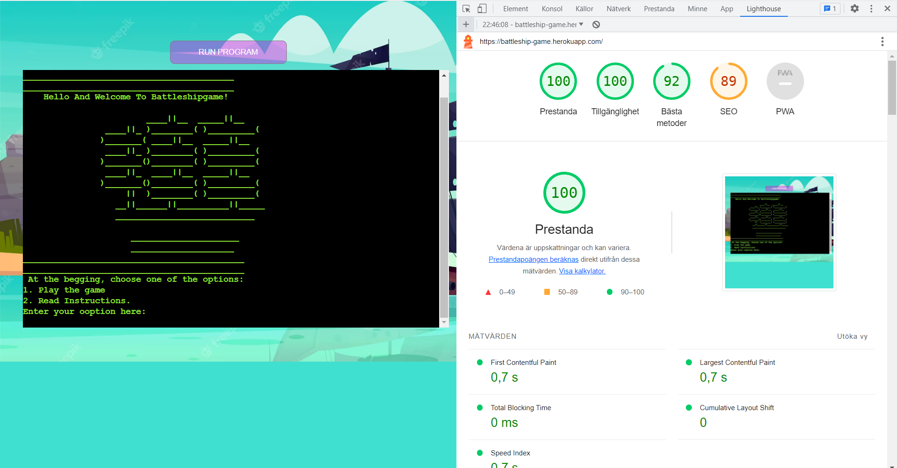

# Battleship Game - Testing details

[Main README.md file](README.md)

[View the live project here](https://battleship-game.herokuapp.com/)

# Automated Testing

## Testing Lighthouse 

## Testing Validator PEP8

No error founds on PEP8online.com

# Manual Testing

### Testing User Experience (UX) stories:

- as a user I want to be welcomed by a start screen with name of the game.
    - Start screen with name of the game is possible immediately after pressing button 'RUN PROGRAM'.
- as a user I want to be able to write my name in the begining of game.
    - Entering a name is possible after the introductory text.
- as a user i want the computer to create boards with ships hidden for me.
    - Computer ships are not visible on the board from the beginning of the game.
- as a user I want the board to be visible to me so I can see which ships are hits and which are misses. 
    - On the board, hited ships are marked with:'x' and missed with: '.'
- as a user, I want to see both boards so I can see everything I need to play.
    - The player board and the computer board are visible to the user.
- as a user, I want to see whose turn it is so I know when it's my turn.
    - The user's turn is when the information is displayed there the user has to select a column and a row of a ship on the board.
- as a user, I want to know who won.
    - The final information at the end of the game shows the final result.

### Test Cases and Results

1. Start Game:
- After pressing 'RUN PROGRAM':
    - The introductory text is shown.
    - The drawing of a ship is shown.
    - The text 'Please, enter your name:' is shown.
        - After pressing a name, the following message is displayed: 'Hello ...!'
    - After entering a name, the following message is displayed:'Press Enter to continue'.
        - After pressing any other key on the keyboard, the game does not start.
        - After pressing enter, game instructions and a table with the number of ships are shown.

2. Create ships:
- The user board shows, the user is supposed to place user's ships:
    - The following message is displayed:'Please, choose some letter between A-G:'.
        - When the user selects a letter between A-G, the following message is displayed: 'Please, choose the row 1-7 of the ship: '
            - when the user select a number except 1-7, the following message is displayed: 'Incorrect! You should choose 1, 2, 3, 4, 5, 6 or 7'.
            - when the user select a number between 1-7, the board game is shown with a ship is marked of the user.
        - When the user selects a letter except A-G, the following message is displayed: 'Incorrect! You should choose A, B, C, D, E, F or G'.

3. Play game:
- The following information is displayed: 'GUESS LOCATIONS OF THE SHIPS ON THE COMPUTER'S GAME BOARD'.
- The computer board is shown, the user is supposed to guess where the computer ships are located.
     - The following message is displayed:'Please, choose some letter between A-G:'.
        - When the user selects a letter between A-G, the following message is displayed: 'Please, choose the row 1-7 of the ship: '
             - when the user select a number except 1-7, the following message is displayed: 'Incorrect! You should choose 1, 2, 3, 4, 5, 6 or 7'.
            - when the user select a number between 1-7, the board game is shown with a ship is marked of the user.
        - When the user selects a letter except A-G, the following message is displayed: 'Incorrect! You should choose A, B, C, D, E, F or G'.
     - When the user enters a letter and number where the ship exists on the computer board, the message: 'HIT!' is displayed, and this place is marked with : 'x'.
     - When the user enters a letter and number where the ship not exists on the computer board, the message: 'MISS!' is displayed, and this place is marked with : '.'.
     - When the user enters a letter and number in a location where a ship has already been hit before, the following message is shown: 'You have already guessed that place!'. 
     - The user has only 5 tries to guess where the ships are located. 
    
4. End game:
- After 5 chances to guess the ships on the board, the game ends and the message: 'GAME OVER! Thank you for plaing ' is shown.

# Bugs
### Solved Bugs

### Remaining Bugs

- No bugs remaining. 